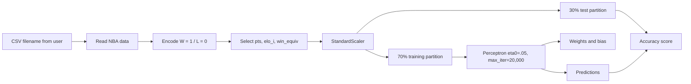

# Model flow

```mermaid
flowchart LR
    A[CSV filename from user] --> B[Read NBA data]
    B --> C[Encode W = 1 / L = 0]
    C --> D[Select pts, elo_i, win_equiv]
    D --> E[StandardScaler]
    E --> F[70% training partition]
    E --> G[30% test partition]
    F --> H[Perceptron eta0=.05, max_iter=20,000]
    H --> I[Weights and bias]
    H --> J[Predictions]
    G --> K[Accuracy score]
    J --> K
```

The CSV is read locally. Invalid columns or non-`W`/`L` results fail fast.
